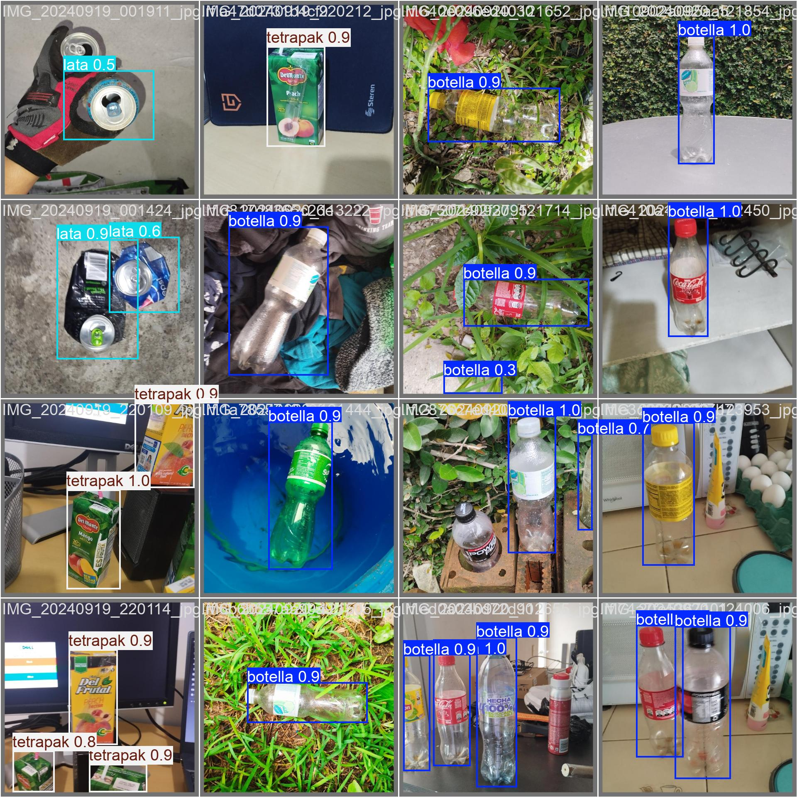

# ClasificadorResiduosIA - Inteligencia Artificial para la Gestión de Residuos Urbanos
ClasificadorResiduosIA es un proyecto de inteligencia artificial diseñado para automatizar la clasificación de residuos reciclables. Utilizando el poder de YOLOv8 y deep learning, este sistema identifica y clasifica desechos comunes como plástico, aluminio y cartón, facilitando la correcta disposición y promoviendo prácticas sostenibles.

Implementado en una Nvidia Jetson Nano, el proyecto está optimizado para su uso en entornos de recursos limitados, ofreciendo una solución eficiente y escalable para la gestión de residuos en entornos urbanos e industriales.

Características principales:
- 🧠 Reconocimiento de imágenes en tiempo real utilizando YOLOv8.
- ♻️ Clasificación automática de residuos reciclables: plástico, aluminio y cartón.
- 💻 Implementación ligera y optimizada para dispositivos embebidos como Nvidia Jetson Nano.
- 📊 Registro detallado de las clasificaciones para su análisis y mejora continua.
- 🚀 Fácil de configurar y desplegar en otros entornos.

## Requisitos Técnicos

|                    | CPU                            | RAM        | DISCO        | GPU                    | Sistema Operativo                |
|--------------------|--------------------------------|------------|--------------|------------------------|----------------------------------|
| Minimos            | Ryzen / Core 3 (> 2020)        | 4 GB       | 6 GB Espacio | Integrado              | Ubuntu 22.04 LTS / Windows 10    |
| Recomendados       | Ryzen / Core 5 (> 2022)        | 8 GB       | 8 GB Espacio | NVIDIA GeForce GT 1030 | Ubuntu 24.04 LTS / Windows 11    |
| Nvidia Jetson Nano | ARMv8 Processor rev 1 (v8l) x2 | 4 GB       | 8 GB Espacio | NVIDIA Tegra X1 (nvgpu)| Ubuntu 18.04 LTS                 |

## Instalación del Modelo

1. Descarga del Modelo
El primer paso es obtener los archivos del modelo.

2. Instalación de Dependencias
Es importante instalar todas las dependencias necesarias, están detalladas en un archivo requirements.txt.

      a. Crear y Activar el Entorno Virtual:
      Crear un entorno virtual asegura que todas las dependencias se manejen de forma aislada para evitar conflictos con otras aplicaciones.
   
      ```bash
      # Crear el entorno virtual
      python3 -m venv env
        
      # Activar el entorno virtual
      # En Linux/MacOS:
      source env/bin/activate
        
      # En Windows:
      .\env\Scripts\activate
      ```

      b. Instalar las Dependencias:
      Una vez activado el entorno virtual, instala las dependencias desde el archivo requirements.txt.

      ```bash
      pip install -r requirements.txt
      ```

3. Ejecución del Modelo
Una vez que tienes el modelo descargado, descomprimido y todas las dependencias instaladas, puedes proceder a la ejecución del modelo.

      a. Ejecución desde la Terminal:
      Linux:
      ```bash
      python script.py --model /ruta/del/modelo/modelo_entrenado.pt --source 0
      ```
      Windows:
      ```bash
      python script.py --model C:\ruta\del\modelo\modelo_entrenado.pt --source 0
      ```

      b. Ejecución Desde Código (usando Python):
      Si prefieres ejecutar el modelo desde código, asegúrate de que el entorno virtual esté activado y ejecuta el script directamente desde un archivo .py.
       Si ejecutas desde la terminal el modelo solo empezara la deteccion y guardara pequeñas capturas de sus detecciones, si ejecutas el codigo este
       abrira una ventana donde estara mostrando en tiempo real las detecciones realizadas por el modelo.
   
      ```python
      import cv2
      from ultralytics import YOLO
      
      # Cargar el modelo la ruta debe coresponder al lugar donde tienes almacenado
      # el proyecto por lo cual aqui esta incompleta
      model = YOLO('/runs/detect/train3/weights/best.pt')
      
      # Inicializar la cámara, por defecto la camara web (integrada) esta en el '0'
      # pero otras externas podrian estar en el 3 o 4 (USB port)
      cap = cv2.VideoCapture(0)
      
      while True:
          ret, frame = cap.read()
      
          if not ret:
              print("No se puede recibir frames. Saliendo...")
              break
      
          results = model(frame)
      
          for result in results:
              if hasattr(result, 'boxes'):
                  detections = result.boxes
      
                  for detection in detections:
                      confidence = detection.conf.item()
                      if confidence > 0.2:
      
                          startX, startY, endX, endY = map(int, detection.xyxy[0])
                          label = f"Class {int(detection.cls.item())}: {confidence:.2f}"
      
                          cv2.rectangle(frame, (startX, startY), (endX, endY), (0, 255, 0), 2)
                          y = startY - 15 if startY - 15 > 15 else startY + 15
                          cv2.putText(frame, label, (startX, y), cv2.FONT_HERSHEY_SIMPLEX, 0.5, (0, 255, 0), 2)
      
          # Mostrar las detecciones
          cv2.imshow("Detecciones en tiempo real", frame)

          # Cerrar al presionar q
          if cv2.waitKey(1) & 0xFF == ord('q'):
              break
      
      cap.release()
      cv2.destroyAllWindows()
      ```

## Funcionamiento del Modelo



La implementación del modelo puede variar significativamente según el objetivo que se desea alcanzar, ya que los modelos de aprendizaje profundo son flexibles y adaptables a múltiples escenarios. Dependiendo del caso de uso, como la detección de objetos, clasificación de imágenes, reconocimiento facial, entre otros, se pueden ajustar los parámetros y la configuración del modelo para optimizar su desempeño.

Además, es posible aprovechar el entrenamiento previamente realizado, un enfoque conocido como transfer learning. Esto permite utilizar un modelo ya entrenado en una gran base de datos y ajustarlo para un nuevo conjunto de datos más específico. Este proceso reduce significativamente el tiempo de entrenamiento, ya que el modelo reutiliza el conocimiento adquirido en tareas anteriores, ajustando únicamente las capas finales para aprender las nuevas características. Esto es especialmente útil cuando se tiene acceso limitado a datos o recursos computacionales.

## Resolución de Problemas

### Problema 1: La ventana de detección no se abre
  Solución:
  1. Verifica que la cámara esté correctamente conectada y funcionando.
  2. Asegúrate de que no haya otro programa utilizando la cámara.
  3. Revisa los permisos de la cámara en tu sistema operativo.

### Problema 2: Errores de Importación
  Solución:
  1. Asegúrate de que el entorno virtual esté activado.
  2. Verifica que todas las dependencias estén instaladas correctamente con pip install -r requirements.txt.

### Problema 3: El modelo no detecta objetos correctamente
  Solución:
  1. Asegúrate de el archivo .pt esté correctamente cargado.
  2. Ajusta el umbral de confianza según sea necesario.

### Logs y Diagnósticos
  Revisa la consola para mensajes de error o advertencias que puedan indicar la causa del problema. Utiliza herramientas de depuración si es necesario.

## Agradecimientos
- Gracias a la comunidad de Ultralytics por el desarrollo de YOLOv8.
- Inspiración y soporte de mis colegas y mentores en el desarrollo de este proyecto.
